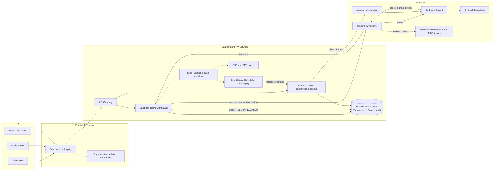

# Architecture

Claude (Opus 5 on Bedrock) is called at two points: once to score a withdrawal and write the risk memo, and once to run the scam-check chat for clients without an advisor. Everything else is plain AWS plumbing around those two calls.

Solid lines are the core build (done by Sat midnight). Dotted lines are stretch.

## What happens on one withdrawal

1. The client submits a withdrawal in the app. `POST /withdrawals` reaches the **submit withdrawal** Lambda.
2. The Lambda loads the account and recent transactions from DynamoDB and calls `ai.score_withdrawal(...)`.
3. That function computes rule-based signals (new payee, full liquidation, client age, unusual timing), then sends the signals and history to **Opus 5**. Claude returns JSON: a score, the signals it weighed, a 120-word memo citing FINRA Rule 2165 and proposed Rule 2166, and anyone who should not be notified.
4. If the score is 70 or higher, the Lambda saves a Case with status `HELD` and the memo. Otherwise it saves `RELEASED`. Each step writes an Audit row.
5. Client, advisor, and fraud team views read the Case. The client confirms or denies, the advisor adds notes, and the fraud team releases, extends, or escalates (`POST /cases/{id}/decision`).
6. Stretch: Step Functions runs steps 4 and 5 as a workflow, SNS and SES send the alerts, and EventBridge Scheduler ends the hold if no one acts.

The whole call takes about 7 seconds (Opus 5 measured at 6.7s for a 120-word memo), which fits inside API Gateway's 29 second limit. Show a "Reviewing..." state in the app while it runs.

## Where Claude is used

| Call | Who calls it | Input | Output | Guardrails |
|---|---|---|---|---|
| `ai.score_withdrawal` | Submit withdrawal Lambda | Account, transaction, last 90 days of history, rule signals | `{ score, level, signals[], memo, do_not_notify[] }` | Stretch: block investment advice and personal info in the memo |
| `ai.scam_check_chat` | Responses Lambda, for clients with no advisor | Case summary, chat so far, client's latest answer | `{ reply, risk_update, done }` | Stretch: same Guardrail, plus never tell the client to move money |

Both use `us.anthropic.claude-opus-5` from one config value. Fall back to `us.anthropic.claude-sonnet-5` if Opus is throttled. See [`AWS_SETUP.md`](AWS_SETUP.md#5-calling-claude).

## Safety rules, and where each lives

| Rule | Enforced in |
|---|---|
| An advisor cannot release a hold alone | Decision Lambda checks the caller's role. Only `fraud` can release |
| Never alert a suspected scammer | `do_not_notify[]` from Claude. The alert step skips those contacts |
| Clients confirm only inside the app | No reply links in alerts. Alerts say "open the app" |
